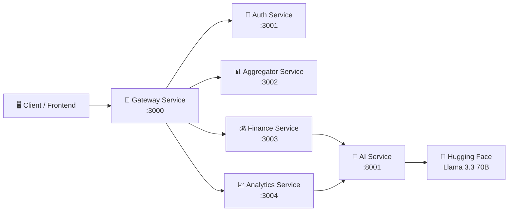

# 📘 FAST API Documentation

**FAST** — Finance, Analytics, Saving & Tracking

> Dokumentasi lengkap seluruh endpoint API beserta skenario pengujian.
> Base URL Production: `https://fst-gateway-service-production.up.railway.app`
> Base URL Local: `http://localhost:3000`

---

## Daftar Isi

- [Autentikasi](#autentikasi)
- [Health Check](#1-health-check)
- [Auth](#2-auth)
- [Profile](#3-profile)
- [Finance — Incomes](#4-finance--incomes)
- [Finance — Transactions](#5-finance--transactions)
- [Finance — Receipts](#6-finance--receipts)
- [Finance — Saving Goals](#7-finance--saving-goals)
- [Finance — Budget](#8-finance--budget)
- [Analytics](#9-analytics)
- [Aggregator](#10-aggregator)

---

## Autentikasi

Sebagian besar endpoint memerlukan **JWT Bearer Token** di header `Authorization`.

```
Authorization: Bearer <access_token>
```

Token didapatkan dari response endpoint `POST /api/auth/login` atau `POST /api/auth/register`.
Token memiliki masa berlaku (expiry). Gunakan `POST /api/auth/refresh` untuk memperbarui token yang sudah kedaluwarsa.

---

## 1. Health Check

Endpoint untuk mengecek status layanan. **Tidak memerlukan autentikasi.**

---

### `GET /health`

**Deskripsi:** Cek status Gateway Service.

**Autentikasi:** ❌ Tidak diperlukan

#### ✅ Skenario Sukses

**Request:**
```json
GET /health
```

**Response (200):**
```json
{
  "status": "ok",
  "service": "API Gateway",
  "timestamp": "2026-05-31T10:00:00.000Z"
}
```

---

### `GET /health/auth`

**Deskripsi:** Cek status Auth Service.

**Autentikasi:** ❌ Tidak diperlukan

#### ✅ Skenario Sukses

**Request:**
```json
GET /health/auth
```

**Response (200):**
```json
{
  "status": "ok",
  "service": "Auth Service"
}
```

---

### `GET /health/finance`

**Deskripsi:** Cek status Finance Service.

**Autentikasi:** ❌ Tidak diperlukan

#### ✅ Skenario Sukses

**Response (200):**
```json
{
  "status": "ok",
  "service": "Finance Service"
}
```

---

### `GET /health/analytics`

**Deskripsi:** Cek status Analytics Service.

**Autentikasi:** ❌ Tidak diperlukan

#### ✅ Skenario Sukses

**Response (200):**
```json
{
  "status": "ok",
  "service": "Analytics Service"
}
```

---

### `GET /health/aggregator`

**Deskripsi:** Cek status Aggregator Service.

**Autentikasi:** ❌ Tidak diperlukan

#### ✅ Skenario Sukses

**Response (200):**
```json
{
  "status": "ok",
  "service": "Aggregator Service"
}
```

---

## 2. Auth

Endpoint untuk autentikasi, registrasi, dan manajemen token.

---

### `POST /api/auth/register`

**Deskripsi:** Mendaftarkan akun baru menggunakan email dan password.

**Autentikasi:** ❌ Tidak diperlukan

**Request Body:**

| Field      | Tipe     | Wajib | Keterangan                |
|------------|----------|-------|---------------------------|
| `name`     | `string` | ✅    | Nama lengkap pengguna     |
| `email`    | `string` | ✅    | Email (format valid)      |
| `password` | `string` | ✅    | Password (min. 8 karakter, harus mengandung huruf besar, huruf kecil, angka, dan simbol) |

#### ✅ Skenario 1: Registrasi Berhasil

**Request:**
```json
{
  "name": "Abdurrahman Hamid",
  "email": "user@example.com",
  "password": "Password123!"
}
```

**Response (201):**
```json
{
  "success": true,
  "message": "Registrasi berhasil. Silakan cek email Anda untuk verifikasi."
}
```

#### ❌ Skenario 2: Email Sudah Terdaftar

**Request:**
```json
{
  "name": "Abdurrahman Hamid",
  "email": "user@example.com",
  "password": "Password123!"
}
```

**Response (409):**
```json
{
  "success": false,
  "message": "Email sudah terdaftar"
}
```

#### ❌ Skenario 3: Validasi Gagal (Password Lemah)

**Request:**
```json
{
  "name": "Abdurrahman",
  "email": "user@example.com",
  "password": "123"
}
```

**Response (400):**
```json
{
  "success": false,
  "message": "Password harus minimal 8 karakter dan mengandung huruf besar, huruf kecil, angka, dan simbol"
}
```

---

### `POST /api/auth/login`

**Deskripsi:** Login menggunakan email dan password. Mengembalikan JWT access token dan refresh token.

**Autentikasi:** ❌ Tidak diperlukan

**Request Body:**

| Field      | Tipe     | Wajib | Keterangan      |
|------------|----------|-------|-----------------|
| `email`    | `string` | ✅    | Email terdaftar  |
| `password` | `string` | ✅    | Password akun    |

#### ✅ Skenario 1: Login Berhasil

**Request:**
```json
{
  "email": "user@example.com",
  "password": "Password123!"
}
```

**Response (200):**
```json
{
  "success": true,
  "message": "Login berhasil",
  "data": {
    "accessToken": "eyJhbGciOiJIUzI1NiIsInR5cCI6IkpXVCJ9...",
    "refreshToken": "eyJhbGciOiJIUzI1NiIsInR5cCI6IkpXVCJ9...",
    "user": {
      "id": "566a7a91-4efd-47e2-9c16-ab7b4c81fc8a",
      "name": "Abdurrahman Hamid",
      "email": "user@example.com",
      "role": "user"
    }
  }
}
```

#### ❌ Skenario 2: Email atau Password Salah

**Request:**
```json
{
  "email": "user@example.com",
  "password": "SalahPassword"
}
```

**Response (401):**
```json
{
  "success": false,
  "message": "Email atau password salah"
}
```

#### ❌ Skenario 3: Email Belum Diverifikasi

**Response (403):**
```json
{
  "success": false,
  "message": "Email belum diverifikasi. Silakan cek inbox email Anda."
}
```

---

### `POST /api/auth/google`

**Deskripsi:** Login atau Register menggunakan akun Google (OAuth 2.0).

**Autentikasi:** ❌ Tidak diperlukan

**Request Body:**

| Field      | Tipe     | Wajib | Keterangan                              |
|------------|----------|-------|-----------------------------------------|
| `code`     | `string` | ✅    | Authorization code dari Google OAuth     |
| `authType` | `string` | ✅    | `"login"` atau `"register"`             |

#### ✅ Skenario 1: Login Google Berhasil

**Request:**
```json
{
  "code": "4/0AX4XfWh...",
  "authType": "login"
}
```

**Response (200):**
```json
{
  "success": true,
  "message": "Login Google berhasil",
  "data": {
    "accessToken": "eyJhbGciOiJIUzI1NiIsInR5cCI6IkpXVCJ9...",
    "refreshToken": "eyJhbGciOiJIUzI1NiIsInR5cCI6IkpXVCJ9...",
    "user": {
      "id": "uuid-here",
      "name": "User Name",
      "email": "user@gmail.com",
      "role": "user"
    }
  }
}
```

#### ❌ Skenario 2: Authorization Code Tidak Valid

**Response (401):**
```json
{
  "success": false,
  "message": "Google authorization code tidak valid atau sudah kedaluwarsa"
}
```

---

### `GET /api/auth/verify-email`

**Deskripsi:** Verifikasi email pengguna melalui link yang dikirim ke email setelah registrasi.

**Autentikasi:** ❌ Tidak diperlukan

**Query Parameters:**

| Parameter | Tipe     | Wajib | Keterangan              |
|-----------|----------|-------|-------------------------|
| `token`   | `string` | ✅    | Token verifikasi email   |

#### ✅ Skenario 1: Verifikasi Berhasil

**Request:**
```
GET /api/auth/verify-email?token=abc123def456
```

**Response (200):**
```json
{
  "success": true,
  "message": "Email berhasil diverifikasi"
}
```

#### ❌ Skenario 2: Token Tidak Valid/Kedaluwarsa

**Response (400):**
```json
{
  "success": false,
  "message": "Token verifikasi tidak valid atau sudah kedaluwarsa"
}
```

---

### `POST /api/auth/resend-verification`

**Deskripsi:** Kirim ulang email verifikasi.

**Autentikasi:** ❌ Tidak diperlukan

**Request Body:**

| Field   | Tipe     | Wajib | Keterangan |
|---------|----------|-------|------------|
| `email` | `string` | ✅    | Email akun  |

#### ✅ Skenario Sukses

**Request:**
```json
{
  "email": "user@example.com"
}
```

**Response (200):**
```json
{
  "success": true,
  "message": "Email verifikasi berhasil dikirim ulang"
}
```

---

### `POST /api/auth/forgot-password`

**Deskripsi:** Meminta link reset password yang dikirim ke email.

**Autentikasi:** ❌ Tidak diperlukan

**Request Body:**

| Field   | Tipe     | Wajib | Keterangan          |
|---------|----------|-------|---------------------|
| `email` | `string` | ✅    | Email akun terdaftar |

#### ✅ Skenario Sukses

**Request:**
```json
{
  "email": "user@example.com"
}
```

**Response (200):**
```json
{
  "success": true,
  "message": "Link reset password telah dikirim ke email"
}
```

---

### `POST /api/auth/reset-password`

**Deskripsi:** Reset password menggunakan token yang dikirim via email.

**Autentikasi:** ❌ Tidak diperlukan

**Request Body:**

| Field      | Tipe     | Wajib | Keterangan                |
|------------|----------|-------|---------------------------|
| `token`    | `string` | ✅    | Token reset dari email     |
| `email`    | `string` | ✅    | Email akun                 |
| `password` | `string` | ✅    | Password baru              |

#### ✅ Skenario Sukses

**Request:**
```json
{
  "token": "reset-token-from-email",
  "email": "user@example.com",
  "password": "NewPassword456!"
}
```

**Response (200):**
```json
{
  "success": true,
  "message": "Password berhasil direset"
}
```

#### ❌ Skenario Gagal: Token Tidak Valid

**Response (400):**
```json
{
  "success": false,
  "message": "Token reset password tidak valid atau sudah kedaluwarsa"
}
```

---

### `POST /api/auth/refresh`

**Deskripsi:** Memperbarui access token yang sudah kedaluwarsa menggunakan refresh token.

**Autentikasi:** ❌ Tidak diperlukan

**Request Body:**

| Field          | Tipe     | Wajib | Keterangan                       |
|----------------|----------|-------|----------------------------------|
| `refreshToken` | `string` | ✅    | Refresh token dari login response |

#### ✅ Skenario Sukses

**Request:**
```json
{
  "refreshToken": "eyJhbGciOiJIUzI1NiIsInR5cCI6IkpXVCJ9..."
}
```

**Response (200):**
```json
{
  "success": true,
  "message": "Token berhasil diperbarui",
  "data": {
    "accessToken": "eyJhbGciOiJIUzI1NiIsInR5cCI6IkpXVCJ9...(new)",
    "refreshToken": "eyJhbGciOiJIUzI1NiIsInR5cCI6IkpXVCJ9...(new)"
  }
}
```

#### ❌ Skenario Gagal: Refresh Token Tidak Valid

**Response (401):**
```json
{
  "success": false,
  "message": "Refresh token tidak valid atau sudah kedaluwarsa"
}
```

---

### `POST /api/auth/logout`

**Deskripsi:** Logout dan menghapus refresh token dari server.

**Autentikasi:** ✅ Bearer Token

**Request Body:**

| Field          | Tipe     | Wajib | Keterangan    |
|----------------|----------|-------|---------------|
| `refreshToken` | `string` | ✅    | Refresh token  |

#### ✅ Skenario Sukses

**Request:**
```json
{
  "refreshToken": "eyJhbGciOiJIUzI1NiIsInR5cCI6IkpXVCJ9..."
}
```

**Response (200):**
```json
{
  "success": true,
  "message": "Logout berhasil"
}
```

---

## 3. Profile

Endpoint untuk manajemen profil pengguna. **Semua endpoint memerlukan autentikasi.**

---

### `GET /api/auth/profile`

**Deskripsi:** Mengambil data profil pengguna yang sedang login.

**Autentikasi:** ✅ Bearer Token

#### ✅ Skenario Sukses

**Response (200):**
```json
{
  "success": true,
  "data": {
    "id": "566a7a91-4efd-47e2-9c16-ab7b4c81fc8a",
    "name": "Abdurrahman Hamid",
    "email": "user@example.com",
    "role": "user",
    "isVerified": true,
    "createdAt": "2026-05-01T10:00:00.000Z"
  }
}
```

#### ❌ Skenario Gagal: Token Expired

**Response (401):**
```json
{
  "success": false,
  "message": "Token expired"
}
```

---

### `PUT /api/auth/profile/password`

**Deskripsi:** Mengubah password akun.

**Autentikasi:** ✅ Bearer Token

**Request Body:**

| Field             | Tipe     | Wajib | Keterangan     |
|-------------------|----------|-------|----------------|
| `currentPassword` | `string` | ✅    | Password lama   |
| `newPassword`     | `string` | ✅    | Password baru   |

#### ✅ Skenario Sukses

**Request:**
```json
{
  "currentPassword": "Password123!",
  "newPassword": "NewPassword456!"
}
```

**Response (200):**
```json
{
  "success": true,
  "message": "Password berhasil diubah"
}
```

#### ❌ Skenario Gagal: Password Lama Salah

**Response (401):**
```json
{
  "success": false,
  "message": "Password lama salah"
}
```

---

### `DELETE /api/auth/profile`

**Deskripsi:** Menghapus akun pengguna secara permanen.

**Autentikasi:** ✅ Bearer Token

**Request Body:**

| Field      | Tipe     | Wajib | Keterangan              |
|------------|----------|-------|-------------------------|
| `password` | `string` | ✅    | Password untuk konfirmasi |

#### ✅ Skenario Sukses

**Request:**
```json
{
  "password": "Password123!"
}
```

**Response (200):**
```json
{
  "success": true,
  "message": "Akun berhasil dihapus"
}
```

#### ❌ Skenario Gagal: Password Tidak Cocok

**Response (401):**
```json
{
  "success": false,
  "message": "Password tidak cocok"
}
```

---

## 4. Finance — Incomes

Endpoint untuk pencatatan dan pengelolaan pemasukan. **Semua endpoint memerlukan autentikasi.**

---

### `POST /api/finance/incomes`

**Deskripsi:** Mencatat pemasukan baru dan mengalokasikan dana ke kategori budget (Kebutuhan Primer, Sekunder, Dana Darurat, Tabungan).

**Autentikasi:** ✅ Bearer Token

**Request Body:**

| Field                      | Tipe      | Wajib | Keterangan                                                     |
|----------------------------|-----------|-------|-----------------------------------------------------------------|
| `amount`                   | `number`  | ✅    | Jumlah pemasukan (Rp)                                           |
| `alloc_kebutuhan_primer`   | `number`  | ✅    | Alokasi untuk kebutuhan primer                                  |
| `alloc_kebutuhan_sekunder` | `number`  | ✅    | Alokasi untuk kebutuhan sekunder                                |
| `alloc_dana_darurat`       | `number`  | ✅    | Alokasi untuk dana darurat                                      |
| `alloc_tabungan`           | `number`  | ✅    | Alokasi untuk tabungan                                          |
| `is_saving_active`         | `boolean` | ✅    | Apakah tabungan dialokasikan ke Saving Goal tertentu            |
| `saving_goal_id`           | `string`  | ❌    | UUID Saving Goal tujuan (wajib jika `is_saving_active` = true)  |
| `income_date`              | `string`  | ✅    | Tanggal pemasukan (format ISO 8601)                             |
| `note`                     | `string`  | ❌    | Catatan (opsional)                                              |

> [!IMPORTANT]
> Total alokasi (`alloc_kebutuhan_primer` + `alloc_kebutuhan_sekunder` + `alloc_dana_darurat` + `alloc_tabungan`) **harus sama persis** dengan `amount`.

#### ✅ Skenario 1: Pemasukan dengan Alokasi Lengkap

**Request:**
```json
{
  "amount": 10000000,
  "alloc_kebutuhan_primer": 5000000,
  "alloc_kebutuhan_sekunder": 3000000,
  "alloc_dana_darurat": 1000000,
  "alloc_tabungan": 1000000,
  "is_saving_active": false,
  "income_date": "2026-05-31T10:00:00.000Z",
  "note": "Gaji Bulanan"
}
```

**Response (201):**
```json
{
  "success": true,
  "message": "Pemasukan berhasil ditambahkan.",
  "data": {
    "income": {
      "id": "uuid-income",
      "userId": "uuid-user",
      "amount": 10000000,
      "allocKebutuhanPrimer": 5000000,
      "allocKebutuhanSekunder": 3000000,
      "allocDanaDarurat": 1000000,
      "allocTabungan": 1000000,
      "isSavingActive": false,
      "incomeDate": "2026-05-31T10:00:00.000Z",
      "note": "Gaji Bulanan",
      "createdAt": "2026-05-31T10:00:00.000Z"
    },
    "budgetAllocation": {
      "period": "2026-05",
      "allocKebutuhanPrimer": 5000000,
      "allocKebutuhanSekunder": 3000000,
      "allocDanaDarurat": 1000000,
      "allocTabungan": 1000000
    }
  }
}
```

#### ✅ Skenario 2: Pemasukan dengan Saving Goal Aktif

**Request:**
```json
{
  "amount": 5000000,
  "alloc_kebutuhan_primer": 2000000,
  "alloc_kebutuhan_sekunder": 1500000,
  "alloc_dana_darurat": 500000,
  "alloc_tabungan": 1000000,
  "is_saving_active": true,
  "saving_goal_id": "uuid-saving-goal",
  "income_date": "2026-05-31T10:00:00.000Z",
  "note": "Freelance Project"
}
```

**Response (201):**
```json
{
  "success": true,
  "message": "Pemasukan berhasil ditambahkan.",
  "data": {
    "income": { "..." : "..." },
    "budgetAllocation": { "..." : "..." },
    "savingGoalUpdate": {
      "goalId": "uuid-saving-goal",
      "addedAmount": 1000000,
      "newCurrentAmount": 2500000
    }
  }
}
```

#### ❌ Skenario 3: Total Alokasi Tidak Sama dengan Amount

**Request:**
```json
{
  "amount": 10000000,
  "alloc_kebutuhan_primer": 5000000,
  "alloc_kebutuhan_sekunder": 3000000,
  "alloc_dana_darurat": 1000000,
  "alloc_tabungan": 500000,
  "is_saving_active": false,
  "income_date": "2026-05-31T10:00:00.000Z"
}
```

**Response (400):**
```json
{
  "success": false,
  "message": "Total alokasi (Rp 9.500.000) harus sama dengan jumlah pemasukan (Rp 10.000.000)"
}
```

---

### `GET /api/finance/incomes`

**Deskripsi:** Mengambil daftar semua pemasukan milik pengguna dengan filter dan paginasi.

**Autentikasi:** ✅ Bearer Token

**Query Parameters (semua opsional):**

| Parameter   | Tipe     | Default | Keterangan                        |
|-------------|----------|---------|-----------------------------------|
| `startDate` | `string` | -       | Filter tanggal mulai (ISO 8601)    |
| `endDate`   | `string` | -       | Filter tanggal akhir (ISO 8601)    |
| `page`      | `number` | `1`     | Nomor halaman                      |
| `limit`     | `number` | `20`    | Jumlah data per halaman            |

#### ✅ Skenario Sukses

**Request:**
```
GET /api/finance/incomes?page=1&limit=10
```

**Response (200):**
```json
{
  "success": true,
  "data": {
    "incomes": [
      {
        "id": "uuid-1",
        "amount": 10000000,
        "allocKebutuhanPrimer": 5000000,
        "allocKebutuhanSekunder": 3000000,
        "allocDanaDarurat": 1000000,
        "allocTabungan": 1000000,
        "isSavingActive": false,
        "incomeDate": "2026-05-31T10:00:00.000Z",
        "note": "Gaji Bulanan",
        "createdAt": "2026-05-31T10:00:00.000Z"
      }
    ],
    "pagination": {
      "page": 1,
      "limit": 10,
      "totalData": 1,
      "totalPages": 1
    }
  }
}
```

---

### `PUT /api/finance/incomes/{id}`

**Deskripsi:** Mengedit data pemasukan yang sudah dicatat.

**Autentikasi:** ✅ Bearer Token

**Path Parameters:**

| Parameter | Tipe     | Wajib | Keterangan       |
|-----------|----------|-------|------------------|
| `id`      | `string` | ✅    | UUID pemasukan    |

**Request Body (semua field opsional):**

| Field                      | Tipe      | Keterangan                           |
|----------------------------|-----------|--------------------------------------|
| `amount`                   | `number`  | Jumlah pemasukan baru                |
| `alloc_kebutuhan_primer`   | `number`  | Alokasi primer baru                  |
| `alloc_kebutuhan_sekunder` | `number`  | Alokasi sekunder baru                |
| `alloc_dana_darurat`       | `number`  | Alokasi darurat baru                 |
| `alloc_tabungan`           | `number`  | Alokasi tabungan baru                |
| `is_saving_active`         | `boolean` | Status saving goal                   |
| `income_date`              | `string`  | Tanggal pemasukan baru               |
| `note`                     | `string`  | Catatan baru                         |

#### ✅ Skenario Sukses

**Request:**
```json
PUT /api/finance/incomes/uuid-income-1

{
  "amount": 12000000,
  "alloc_kebutuhan_primer": 6000000,
  "alloc_kebutuhan_sekunder": 3500000,
  "alloc_dana_darurat": 1000000,
  "alloc_tabungan": 1500000,
  "is_saving_active": false,
  "income_date": "2026-05-31T10:00:00.000Z",
  "note": "Gaji + Bonus"
}
```

**Response (200):**
```json
{
  "success": true,
  "message": "Pemasukan berhasil diperbarui"
}
```

#### ❌ Skenario Gagal: ID Tidak Ditemukan

**Response (404):**
```json
{
  "success": false,
  "message": "Pemasukan tidak ditemukan"
}
```

---

### `DELETE /api/finance/incomes/{id}`

**Deskripsi:** Menghapus data pemasukan.

**Autentikasi:** ✅ Bearer Token

**Path Parameters:**

| Parameter | Tipe     | Wajib | Keterangan       |
|-----------|----------|-------|------------------|
| `id`      | `string` | ✅    | UUID pemasukan    |

#### ✅ Skenario Sukses

**Response (200):**
```json
{
  "success": true,
  "message": "Pemasukan berhasil dihapus"
}
```

#### ❌ Skenario Gagal: ID Tidak Ditemukan

**Response (404):**
```json
{
  "success": false,
  "message": "Pemasukan tidak ditemukan"
}
```

---

## 5. Finance — Transactions

Endpoint untuk pencatatan pengeluaran (Quick Input). **Semua endpoint memerlukan autentikasi.**

---

### `POST /api/finance/transactions`

**Deskripsi:** Mencatat pengeluaran baru. Saldo akan diambil dari budget kategori yang dipilih (`parent_category`).

**Autentikasi:** ✅ Bearer Token

**Request Body:**

| Field              | Tipe     | Wajib | Keterangan                                                        |
|--------------------|----------|-------|-------------------------------------------------------------------|
| `type`             | `string` | ✅    | Tipe transaksi: `"expense"`                                       |
| `amount`           | `number` | ✅    | Jumlah pengeluaran (Rp)                                           |
| `name`             | `string` | ✅    | Nama/deskripsi pengeluaran                                        |
| `parent_category`  | `string` | ✅    | Kategori budget: `"kebutuhan_primer"`, `"kebutuhan_sekunder"`, atau `"dana_darurat"` |
| `transaction_date` | `string` | ✅    | Tanggal transaksi (format ISO 8601)                               |

> [!WARNING]
> Jika saldo budget kategori tidak mencukupi, sistem akan mencoba mengambil dari **Tabungan Umum**. Jika tabungan juga tidak cukup, transaksi akan **ditolak** (400).

#### ✅ Skenario 1: Pengeluaran Berhasil

**Request:**
```json
{
  "type": "expense",
  "amount": 150000,
  "name": "Beli Kopi dan Cemilan",
  "parent_category": "kebutuhan_sekunder",
  "transaction_date": "2026-05-31T12:00:00.000Z"
}
```

**Response (201):**
```json
{
  "success": true,
  "message": "Transaksi berhasil dicatat",
  "data": {
    "id": "uuid-transaction",
    "userId": "uuid-user",
    "type": "expense",
    "amount": 150000,
    "name": "Beli Kopi dan Cemilan",
    "parentCategory": "kebutuhan_sekunder",
    "transactionDate": "2026-05-31T12:00:00.000Z",
    "createdAt": "2026-05-31T12:00:00.000Z"
  }
}
```

#### ❌ Skenario 2: Saldo Budget Tidak Cukup

**Request:**
```json
{
  "type": "expense",
  "amount": 50000000,
  "name": "Beli Laptop",
  "parent_category": "kebutuhan_primer",
  "transaction_date": "2026-05-31T12:00:00.000Z"
}
```

**Response (400):**
```json
{
  "success": false,
  "message": "Saldo budget kategori tidak mencukupi, dan Tabungan Umum (Sisa: Rp 2000000) tidak cukup untuk menutupi total defisit (Rp 35730000)."
}
```

---

### `GET /api/finance/transactions`

**Deskripsi:** Mengambil histori transaksi (pengeluaran) milik pengguna dengan filter dan paginasi.

**Autentikasi:** ✅ Bearer Token

**Query Parameters (semua opsional):**

| Parameter         | Tipe     | Default | Keterangan                                                          |
|-------------------|----------|---------|---------------------------------------------------------------------|
| `type`            | `string` | -       | Filter tipe: `"expense"`, `"saving_transfer"`, `"emergency_used"`    |
| `parent_category` | `string` | -       | Filter kategori: `"kebutuhan_primer"`, `"kebutuhan_sekunder"`, `"dana_darurat"`, `"tabungan"` |
| `sub_category`    | `string` | -       | Filter sub-kategori (misal: `"Makanan"`)                             |
| `start_date`      | `string` | -       | Filter tanggal mulai (ISO 8601)                                      |
| `end_date`        | `string` | -       | Filter tanggal akhir (ISO 8601)                                      |
| `page`            | `number` | `1`     | Nomor halaman                                                        |
| `limit`           | `number` | `20`    | Jumlah data per halaman                                              |

#### ✅ Skenario Sukses

**Request:**
```
GET /api/finance/transactions?parent_category=kebutuhan_primer&page=1&limit=10
```

**Response (200):**
```json
{
  "success": true,
  "data": {
    "transactions": [
      {
        "id": "uuid-1",
        "type": "expense",
        "amount": 150000,
        "name": "Beli Kopi dan Cemilan",
        "parentCategory": "kebutuhan_sekunder",
        "category": "Minuman",
        "transactionDate": "2026-05-31T12:00:00.000Z"
      }
    ],
    "pagination": {
      "page": 1,
      "limit": 10,
      "totalData": 1,
      "totalPages": 1
    }
  }
}
```

---

### `PUT /api/finance/transactions/{id}`

**Deskripsi:** Mengedit data transaksi pengeluaran.

**Autentikasi:** ✅ Bearer Token

**Path Parameters:**

| Parameter | Tipe     | Wajib | Keterangan        |
|-----------|----------|-------|--------------------|
| `id`      | `string` | ✅    | UUID transaksi      |

#### ✅ Skenario Sukses

**Request:**
```json
PUT /api/finance/transactions/uuid-transaction-1

{
  "amount": 200000,
  "name": "Beli Kopi Premium"
}
```

**Response (200):**
```json
{
  "success": true,
  "message": "Pengeluaran berhasil diperbarui"
}
```

---

### `DELETE /api/finance/transactions/{id}`

**Deskripsi:** Menghapus data transaksi pengeluaran.

**Autentikasi:** ✅ Bearer Token

**Path Parameters:**

| Parameter | Tipe     | Wajib | Keterangan        |
|-----------|----------|-------|--------------------|
| `id`      | `string` | ✅    | UUID transaksi      |

#### ✅ Skenario Sukses

**Response (200):**
```json
{
  "success": true,
  "message": "Pengeluaran berhasil dihapus"
}
```

---

## 6. Finance — Receipts

Endpoint untuk pencatatan struk belanja (manual atau OCR). **Semua endpoint memerlukan autentikasi.**

---

### `POST /api/finance/receipts/ocr`

**Deskripsi:** Upload gambar struk belanja untuk diproses oleh AI (OCR + Klasifikasi otomatis). Hasil OCR perlu dikonfirmasi sebelum dicatat.

**Autentikasi:** ✅ Bearer Token

**Rate Limit:** Ketat (untuk mencegah penyalahgunaan)

**Request Body:** `multipart/form-data`

| Field   | Tipe     | Wajib | Keterangan                            |
|---------|----------|-------|---------------------------------------|
| `image` | `file`   | ✅    | File gambar struk (jpg/png/webp)       |

#### ✅ Skenario 1: OCR Berhasil

**Response (200):**
```json
{
  "success": true,
  "message": "OCR berhasil diproses. Silakan konfirmasi hasilnya.",
  "data": {
    "receiptId": "uuid-receipt",
    "store_name": "Indomaret",
    "date": "2026-05-31",
    "total_amount": 85000,
    "items": [
      {
        "name": "Indomie Goreng 5pcs",
        "price": 17500,
        "category": "Makanan"
      },
      {
        "name": "Aqua 1500ml",
        "price": 5500,
        "category": "Minuman"
      }
    ],
    "confidence_score": 0.92
  }
}
```

#### ❌ Skenario 2: Gambar Tidak Bisa Dibaca

**Response (400):**
```json
{
  "success": false,
  "message": "Gagal memproses gambar struk. Pastikan gambar jelas dan tidak buram."
}
```

---

### `POST /api/finance/receipts/manual`

**Deskripsi:** Mencatat struk belanja secara manual (tanpa OCR).

**Autentikasi:** ✅ Bearer Token

**Request Body:**

| Field          | Tipe     | Wajib | Keterangan                |
|----------------|----------|-------|---------------------------|
| `store_name`   | `string` | ✅    | Nama toko                  |
| `receipt_date` | `string` | ✅    | Tanggal struk (ISO 8601)   |
| `subtotal`     | `number` | ✅    | Subtotal sebelum pajak     |
| `tax`          | `number` | ✅    | Pajak                      |
| `discount`     | `number` | ✅    | Diskon                     |
| `total`        | `number` | ✅    | Total akhir                |
| `source`       | `string` | ✅    | Sumber: `"manual"`         |
| `items`        | `array`  | ✅    | Daftar item belanja        |

**Items Schema:**

| Field         | Tipe     | Wajib | Keterangan       |
|---------------|----------|-------|------------------|
| `item_name`   | `string` | ✅    | Nama item         |
| `qty`         | `number` | ✅    | Jumlah item       |
| `unit_price`  | `number` | ✅    | Harga satuan      |
| `total_price` | `number` | ✅    | Harga total item  |

#### ✅ Skenario Sukses

**Request:**
```json
{
  "store_name": "Indomaret Cipete",
  "receipt_date": "2026-05-31T12:00:00.000Z",
  "subtotal": 80000,
  "tax": 5000,
  "discount": 0,
  "total": 85000,
  "source": "manual",
  "items": [
    {
      "item_name": "Indomie Goreng 5pcs",
      "qty": 1,
      "unit_price": 17500,
      "total_price": 17500
    },
    {
      "item_name": "Aqua 1500ml",
      "qty": 2,
      "unit_price": 5500,
      "total_price": 11000
    }
  ]
}
```

**Response (201):**
```json
{
  "success": true,
  "message": "Struk manual berhasil dicatat"
}
```

---

### `GET /api/finance/receipts/{id}`

**Deskripsi:** Mengambil detail struk berdasarkan ID.

**Autentikasi:** ✅ Bearer Token

**Path Parameters:**

| Parameter | Tipe     | Wajib | Keterangan  |
|-----------|----------|-------|-------------|
| `id`      | `string` | ✅    | UUID struk   |

#### ✅ Skenario Sukses

**Response (200):**
```json
{
  "success": true,
  "data": {
    "id": "uuid-receipt",
    "storeName": "Indomaret",
    "receiptDate": "2026-05-31T12:00:00.000Z",
    "subtotal": 80000,
    "tax": 5000,
    "discount": 0,
    "total": 85000,
    "source": "ocr",
    "status": "pending",
    "items": [
      {
        "itemName": "Indomie Goreng 5pcs",
        "qty": 1,
        "unitPrice": 17500,
        "totalPrice": 17500,
        "category": "Makanan"
      }
    ]
  }
}
```

---

### `POST /api/finance/receipts/{id}/confirm`

**Deskripsi:** Mengkonfirmasi hasil OCR yang sudah diproses. Setelah dikonfirmasi, data struk akan dicatat sebagai transaksi resmi dan memotong saldo budget.

**Autentikasi:** ✅ Bearer Token

**Path Parameters:**

| Parameter | Tipe     | Wajib | Keterangan  |
|-----------|----------|-------|-------------|
| `id`      | `string` | ✅    | UUID struk   |

**Request Body:**

| Field              | Tipe     | Wajib | Keterangan                                                         |
|--------------------|----------|-------|--------------------------------------------------------------------|
| `parent_category`  | `string` | ✅    | Kategori budget: `"kebutuhan_primer"`, `"kebutuhan_sekunder"`, `"dana_darurat"` |
| *(field koreksi)*  | `any`    | ❌    | Field opsional untuk mengoreksi hasil OCR sebelum konfirmasi        |

#### ✅ Skenario Sukses

**Request:**
```json
POST /api/finance/receipts/uuid-receipt/confirm

{
  "parent_category": "kebutuhan_primer"
}
```

**Response (200):**
```json
{
  "success": true,
  "message": "Struk OCR berhasil dikonfirmasi dan dicatat"
}
```

---

### `POST /api/finance/receipts/{id}/reject`

**Deskripsi:** Menolak hasil OCR. Data struk tidak akan diproses menjadi transaksi dan budget tidak akan terpotong.

**Autentikasi:** ✅ Bearer Token

**Path Parameters:**

| Parameter | Tipe     | Wajib | Keterangan  |
|-----------|----------|-------|-------------|
| `id`      | `string` | ✅    | UUID struk   |

#### ✅ Skenario Sukses

**Request:**
```
POST /api/finance/receipts/uuid-receipt/reject
```

**Response (200):**
```json
{
  "success": true,
  "message": "Receipt ditolak. Data tidak diproses menjadi transaksi."
}
```

#### ❌ Skenario Gagal: Struk Sudah Dikonfirmasi

**Response (400):**
```json
{
  "success": false,
  "message": "Receipt sudah dikonfirmasi sebelumnya"
}
```

---

### `PUT /api/finance/receipts/{receiptId}/items/{itemId}/category`

**Deskripsi:** Mengoreksi kategori item struk sebelum dikonfirmasi (override kategori AI).

**Autentikasi:** ✅ Bearer Token

**Path Parameters:**

| Parameter    | Tipe     | Wajib | Keterangan      |
|--------------|----------|-------|-----------------|
| `receiptId`  | `string` | ✅    | UUID struk       |
| `itemId`     | `string` | ✅    | UUID item struk  |

**Request Body (minimal satu field wajib diisi):**

| Field                      | Tipe     | Wajib | Keterangan                                                         |
|----------------------------|----------|-------|---------------------------------------------------------------------|
| `override_sub_category`    | `string` | ❌    | Kategori sub baru (misal: `"Makanan"`, `"Minuman"`)                 |
| `override_parent_category` | `string` | ❌    | Kategori induk baru: `"kebutuhan_primer"`, `"kebutuhan_sekunder"`, `"dana_darurat"` |

#### ✅ Skenario Sukses

**Request:**
```json
PUT /api/finance/receipts/uuid-receipt/items/uuid-item/category

{
  "override_sub_category": "Makanan",
  "override_parent_category": "kebutuhan_primer"
}
```

**Response (200):**
```json
{
  "success": true,
  "message": "Kategori item berhasil diupdate.",
  "data": {
    "id": "uuid-item",
    "itemName": "Indomie Goreng",
    "overrideSubCategory": "Makanan",
    "overrideParentCategory": "kebutuhan_primer"
  }
}
```

---

## 7. Finance — Saving Goals

Endpoint untuk manajemen target tabungan. **Semua endpoint memerlukan autentikasi.**

---

### `POST /api/finance/saving-goals`

**Deskripsi:** Membuat target tabungan baru.

**Autentikasi:** ✅ Bearer Token

**Request Body:**

| Field              | Tipe     | Wajib | Keterangan                                      |
|--------------------|----------|-------|-------------------------------------------------|
| `goal_name`        | `string` | ✅    | Nama tujuan tabungan                             |
| `target_amount`    | `number` | ✅    | Jumlah target (Rp)                               |
| `saving_frequency` | `string` | ✅    | Frekuensi menabung: `"daily"`, `"weekly"`, `"monthly"` |
| `saving_amount`    | `number` | ✅    | Jumlah per frekuensi (Rp)                        |

#### ✅ Skenario Sukses

**Request:**
```json
{
  "goal_name": "iPhone 16 Pro",
  "target_amount": 25000000,
  "saving_frequency": "monthly",
  "saving_amount": 2500000
}
```

**Response (201):**
```json
{
  "success": true,
  "message": "Saving goal berhasil dibuat",
  "data": {
    "id": "uuid-goal",
    "goalName": "iPhone 16 Pro",
    "targetAmount": 25000000,
    "currentAmount": 0,
    "savingFrequency": "monthly",
    "savingAmount": 2500000,
    "status": "active",
    "createdAt": "2026-05-31T10:00:00.000Z"
  }
}
```

---

### `GET /api/finance/saving-goals`

**Deskripsi:** Mengambil daftar semua Saving Goals milik pengguna.

**Autentikasi:** ✅ Bearer Token

#### ✅ Skenario Sukses

**Response (200):**
```json
{
  "success": true,
  "data": [
    {
      "id": "uuid-goal-1",
      "goalName": "iPhone 16 Pro",
      "targetAmount": 25000000,
      "currentAmount": 5000000,
      "savingFrequency": "monthly",
      "savingAmount": 2500000,
      "status": "active",
      "progressPercent": 20
    },
    {
      "id": "uuid-goal-2",
      "goalName": "Dana Liburan",
      "targetAmount": 10000000,
      "currentAmount": 10000000,
      "savingFrequency": "weekly",
      "savingAmount": 500000,
      "status": "completed",
      "progressPercent": 100
    }
  ]
}
```

---

### `PUT /api/finance/saving-goals/{id}`

**Deskripsi:** Mengedit data Saving Goal.

**Autentikasi:** ✅ Bearer Token

**Path Parameters:**

| Parameter | Tipe     | Wajib | Keterangan          |
|-----------|----------|-------|---------------------|
| `id`      | `string` | ✅    | UUID saving goal     |

#### ✅ Skenario Sukses

**Request:**
```json
PUT /api/finance/saving-goals/uuid-goal-1

{
  "goal_name": "iPhone 16 Pro Max",
  "target_amount": 30000000
}
```

**Response (200):**
```json
{
  "success": true,
  "message": "Saving goal berhasil diperbarui"
}
```

---

### `DELETE /api/finance/saving-goals/{id}`

**Deskripsi:** Menghapus Saving Goal.

**Autentikasi:** ✅ Bearer Token

**Path Parameters:**

| Parameter | Tipe     | Wajib | Keterangan          |
|-----------|----------|-------|---------------------|
| `id`      | `string` | ✅    | UUID saving goal     |

#### ✅ Skenario Sukses

**Response (200):**
```json
{
  "success": true,
  "message": "Saving goal berhasil dihapus"
}
```

---

### `POST /api/finance/saving-goals/{id}/add-money`

**Deskripsi:** Menambahkan dana ke Saving Goal tertentu.

**Autentikasi:** ✅ Bearer Token

**Path Parameters:**

| Parameter | Tipe     | Wajib | Keterangan          |
|-----------|----------|-------|---------------------|
| `id`      | `string` | ✅    | UUID saving goal     |

**Request Body:**

| Field    | Tipe     | Wajib | Keterangan                    |
|----------|----------|-------|-------------------------------|
| `amount` | `number` | ✅    | Jumlah dana yang ditambahkan   |
| `note`   | `string` | ❌    | Catatan (opsional)             |

#### ✅ Skenario Sukses

**Request:**
```json
{
  "amount": 1000000,
  "note": "Top up dari sisa gaji"
}
```

**Response (200):**
```json
{
  "success": true,
  "message": "Dana berhasil ditambahkan",
  "data": {
    "goalId": "uuid-goal-1",
    "addedAmount": 1000000,
    "newCurrentAmount": 6000000,
    "progressPercent": 24
  }
}
```

---

## 8. Finance — Budget

Endpoint untuk melihat dan mengatur anggaran. **Semua endpoint memerlukan autentikasi.**

---

### `GET /api/finance/budget/summary`

**Deskripsi:** Mengambil ringkasan anggaran bulan berjalan (alokasi, pengeluaran, dan sisa per kategori).

**Autentikasi:** ✅ Bearer Token

#### ✅ Skenario 1: Budget Tersedia

**Response (200):**
```json
{
  "success": true,
  "data": {
    "period": "2026-05",
    "categories": {
      "kebutuhan_primer": {
        "allocated": 400000,
        "spent": 370000,
        "remaining": 30000,
        "pct_used": 93
      },
      "kebutuhan_sekunder": {
        "allocated": 300000,
        "spent": 300000,
        "remaining": 0,
        "pct_used": 100
      },
      "dana_darurat": {
        "allocated": 100000,
        "spent": 0,
        "remaining": 100000,
        "pct_used": 0
      },
      "tabungan": {
        "allocated": 0,
        "spent": 0,
        "remaining": 0,
        "pct_used": 0
      }
    },
    "total_allocated": 800000,
    "total_spent": 670000,
    "total_remaining": 130000
  }
}
```

#### ✅ Skenario 2: Belum Ada Budget (User Baru)

**Response (200):**
```json
{
  "success": true,
  "data": {
    "period": "2026-05",
    "categories": {
      "kebutuhan_primer": { "allocated": 0, "spent": 0, "remaining": 0, "pct_used": 0 },
      "kebutuhan_sekunder": { "allocated": 0, "spent": 0, "remaining": 0, "pct_used": 0 },
      "dana_darurat": { "allocated": 0, "spent": 0, "remaining": 0, "pct_used": 0 },
      "tabungan": { "allocated": 0, "spent": 0, "remaining": 0, "pct_used": 0 }
    },
    "total_allocated": 0,
    "total_spent": 0,
    "total_remaining": 0
  }
}
```

---

### `PUT /api/finance/budget/{period}`

**Deskripsi:** Mengubah alokasi budget untuk bulan tertentu. Hanya dapat mengubah Kebutuhan Primer, Sekunder, dan Dana Darurat. **Tabungan tidak dapat diubah** (hanya bisa dialokasikan melalui pencatatan pemasukan).

**Autentikasi:** ✅ Bearer Token

**Path Parameters:**

| Parameter | Tipe     | Wajib | Keterangan                          |
|-----------|----------|-------|-------------------------------------|
| `period`  | `string` | ✅    | Format `YYYY-MM`, contoh: `2026-05`  |

**Request Body (semua opsional):**

| Field                      | Tipe     | Keterangan               |
|----------------------------|----------|--------------------------|
| `alloc_kebutuhan_primer`   | `number` | Alokasi primer baru       |
| `alloc_kebutuhan_sekunder` | `number` | Alokasi sekunder baru     |
| `alloc_dana_darurat`       | `number` | Alokasi dana darurat baru  |

> [!IMPORTANT]
> Field `alloc_tabungan` **TIDAK BISA** diubah melalui endpoint ini. Tabungan hanya bisa dialokasikan melalui pencatatan pemasukan (`POST /api/finance/incomes`).

#### ✅ Skenario Sukses

**Request:**
```json
PUT /api/finance/budget/2026-05

{
  "alloc_kebutuhan_primer": 6000000,
  "alloc_kebutuhan_sekunder": 2500000,
  "alloc_dana_darurat": 500000
}
```

**Response (200):**
```json
{
  "success": true,
  "message": "Budget berhasil diperbarui"
}
```

---

## 9. Analytics

Endpoint untuk analisis keuangan dan insight dari AI. **Semua endpoint memerlukan autentikasi.**

---

### `GET /api/analytics/summary`

**Deskripsi:** Mengambil ringkasan data keuangan (aset total, pemasukan/pengeluaran bulan ini, tren pengeluaran 7 hari).

**Autentikasi:** ✅ Bearer Token

#### ✅ Skenario Sukses

**Response (200):**
```json
{
  "success": true,
  "message": "Dashboard summary retrieved successfully",
  "data": {
    "asset": {
      "total": 350000,
      "percentageChange": 100
    },
    "income": {
      "total": 1000000
    },
    "expense": {
      "total": 650000
    },
    "expenseTrend": [
      { "day": "Min", "amount": 0 },
      { "day": "Sen", "amount": 0 },
      { "day": "Sel", "amount": 0 },
      { "day": "Rab", "amount": 0 },
      { "day": "Kam", "amount": 0 },
      { "day": "Jum", "amount": 0 },
      { "day": "Sab", "amount": 650000 }
    ]
  }
}
```

---

### `GET /api/analytics/health`

**Deskripsi:** Menghitung skor kesehatan keuangan pengguna berdasarkan rasio tabungan dan kondisi budget.

**Autentikasi:** ✅ Bearer Token

**Algoritma Penilaian:**

| Kondisi                             | Skor    | Status          |
|--------------------------------------|---------|-----------------|
| Tabungan ≥ 20% dari pemasukan       | 80-100  | SANGAT SEHAT    |
| Tabungan 10-19% dari pemasukan      | 60-80   | SEHAT           |
| Tabungan 0-9% dari pemasukan        | 40-60   | CUKUP           |
| Pengeluaran > pemasukan             | 0-40    | KURANG SEHAT    |
| Budget Primer habis (≥ 100% terpakai) | Max 45  | KURANG SEHAT    |
| Budget Primer kritis (≥ 80% terpakai) | Max 65  | SEHAT (diturunkan) |
| Belum ada transaksi                 | 100     | NETRAL          |

#### ✅ Skenario 1: Keuangan Sehat

**Response (200):**
```json
{
  "success": true,
  "message": "Financial health retrieved successfully",
  "data": {
    "financialHealth": {
      "score": 90,
      "status": "SANGAT SEHAT",
      "message": "Hebat! Kamu berhasil menabung lebih dari 20% pendapatanmu bulan ini."
    }
  }
}
```

#### ✅ Skenario 2: Budget Primer Kritis (≥ 80%)

**Response (200):**
```json
{
  "success": true,
  "message": "Financial health retrieved successfully",
  "data": {
    "financialHealth": {
      "score": 65,
      "status": "SEHAT",
      "message": "Hati-hati! Budget Kebutuhan Primer-mu sudah terpakai lebih dari 80%. Kurangi pengeluaran agar tidak defisit di akhir bulan."
    }
  }
}
```

#### ✅ Skenario 3: Budget Primer Habis/Defisit (100%)

**Response (200):**
```json
{
  "success": true,
  "message": "Financial health retrieved successfully",
  "data": {
    "financialHealth": {
      "score": 45,
      "status": "KURANG SEHAT",
      "message": "Bahaya! Budget Kebutuhan Primer-mu sudah habis/defisit. Segera atur ulang pengeluaranmu meskipun sisa tabunganmu masih banyak."
    }
  }
}
```

---

### `GET /api/analytics/recent`

**Deskripsi:** Mengambil daftar transaksi terbaru (terakhir 5 transaksi).

**Autentikasi:** ✅ Bearer Token

#### ✅ Skenario Sukses

**Response (200):**
```json
{
  "success": true,
  "message": "Recent transactions retrieved successfully",
  "data": {
    "recentTransactions": [
      {
        "id": "uuid-1",
        "name": "Receipt: Indomaret (kebutuhan_primer)",
        "amount": 150000,
        "type": "expense",
        "category": "Makanan",
        "date": "2026-05-31T12:00:00.000Z"
      },
      {
        "id": "uuid-2",
        "name": "Gaji Bulanan",
        "amount": 1000000,
        "type": "income",
        "category": null,
        "date": "2026-05-31T10:00:00.000Z"
      }
    ]
  }
}
```

---

### `GET /api/analytics/insight`

**Deskripsi:** Mengambil insight keuangan yang dihasilkan oleh AI (Llama 3.3 70B). Insight berisi analisis mendalam dan tips praktis berdasarkan data keuangan pengguna saat ini (pemasukan, pengeluaran, budget, dan tren).

**Autentikasi:** ✅ Bearer Token

> [!NOTE]
> Insight dihasilkan oleh model AI **Llama 3.3 70B Instruct** melalui Hugging Face Inference API. Jika AI Service tidak tersedia, sistem akan mengembalikan insight fallback berbasis logika manual.

#### ✅ Skenario 1: Insight dari AI (Berhasil)

**Response (200):**
```json
{
  "success": true,
  "message": "Dashboard insight retrieved successfully",
  "data": {
    "insight": "Keuanganmu bulan ini cukup mengkhawatirkan. Budget Kebutuhan Sekunder sudah habis 100% dan Kebutuhan Primer sudah terpakai 93%. Padahal bulan belum berakhir. Tips: Coba terapkan metode 'no-spend day' di sisa hari bulan ini, yaitu hari di mana kamu sama sekali tidak mengeluarkan uang. Selain itu, evaluasi pengeluaran sekunder yang paling besar dan tanyakan pada dirimu apakah itu benar-benar kebutuhan atau keinginan sesaat."
  }
}
```

#### ✅ Skenario 2: Insight Fallback (AI Tidak Tersedia)

**Response (200):**
```json
{
  "success": true,
  "message": "Dashboard insight retrieved successfully",
  "data": {
    "insight": "Luar biasa! Kamu berhasil menabung 35% dari pendapatanmu bulan ini. Pertahankan kebiasaan baik ini untuk mencapai kebebasan finansial!"
  }
}
```

---

## 10. Aggregator

Endpoint untuk menggabungkan semua data dashboard dalam satu panggilan API. **Memerlukan autentikasi.**

---

### `GET /api/aggregator/dashboard`

**Deskripsi:** Mengambil seluruh data dashboard dalam satu kali pemanggilan. Menggabungkan data dari Finance Service dan Analytics Service: informasi user, aset, pemasukan, pengeluaran, tren, skor kesehatan, dan transaksi terbaru.

**Autentikasi:** ✅ Bearer Token

#### ✅ Skenario Sukses

**Response (200):**
```json
{
  "success": true,
  "message": "Aggregated home data retrieved successfully",
  "data": {
    "user": {
      "name": "Abdurrahman Hamid",
      "email": "user@example.com"
    },
    "dashboard": {
      "asset": {
        "total": 350000,
        "percentageChange": 100
      },
      "income": {
        "total": 1000000
      },
      "expense": {
        "total": 650000
      },
      "expenseTrend": [
        { "day": "Min", "amount": 0 },
        { "day": "Sen", "amount": 0 },
        { "day": "Sel", "amount": 0 },
        { "day": "Rab", "amount": 0 },
        { "day": "Kam", "amount": 0 },
        { "day": "Jum", "amount": 0 },
        { "day": "Sab", "amount": 650000 }
      ],
      "financialHealth": {
        "score": 45,
        "status": "KURANG SEHAT",
        "message": "Bahaya! Budget Kebutuhan Primer-mu sudah habis/defisit. Segera atur ulang pengeluaranmu meskipun sisa tabunganmu masih banyak."
      },
      "recentTransactions": [
        {
          "id": "uuid-1",
          "name": "Receipt: Developer Properti (kebutuhan_primer)",
          "amount": 150000,
          "type": "expense",
          "category": "Lainnya",
          "date": "2026-05-30T12:00:00.000Z"
        },
        {
          "id": "uuid-2",
          "name": "Receipt: Developer Properti (kebutuhan_primer)",
          "amount": 50000,
          "type": "expense",
          "category": "Lainnya",
          "date": "2026-05-30T12:00:00.000Z"
        }
      ]
    }
  }
}
```

#### ❌ Skenario Gagal: Token Expired

**Response (401):**
```json
{
  "success": false,
  "message": "Token expired"
}
```

---

## Error Umum (Berlaku untuk Semua Endpoint)

Berikut adalah error yang dapat muncul di semua endpoint yang memerlukan autentikasi:

| HTTP Code | Kondisi                             | Response Body                                                |
|-----------|-------------------------------------|--------------------------------------------------------------|
| `401`     | Tidak ada token / token invalid     | `{ "success": false, "message": "Unauthorized" }`           |
| `401`     | Token sudah kedaluwarsa             | `{ "success": false, "message": "Token expired" }`          |
| `404`     | Endpoint tidak ditemukan            | `{ "success": false, "message": "Endpoint /xxx not found" }`|
| `429`     | Rate limit terlampaui               | `{ "success": false, "message": "Too many requests" }`      |
| `500`     | Internal server error               | `{ "success": false, "message": "Internal server error" }`  |

---

## Catatan Arsitektur



> [!NOTE]
> - **Gateway Service** bertindak sebagai reverse proxy dan menangani autentikasi JWT.
> - **AI Service** hanya dipanggil secara internal oleh Finance Service (untuk OCR) dan Analytics Service (untuk Insight). AI **tidak** bisa diakses langsung melalui Gateway.
> - Semua komunikasi internal antar service menggunakan header `x-internal-auth` untuk otorisasi.
