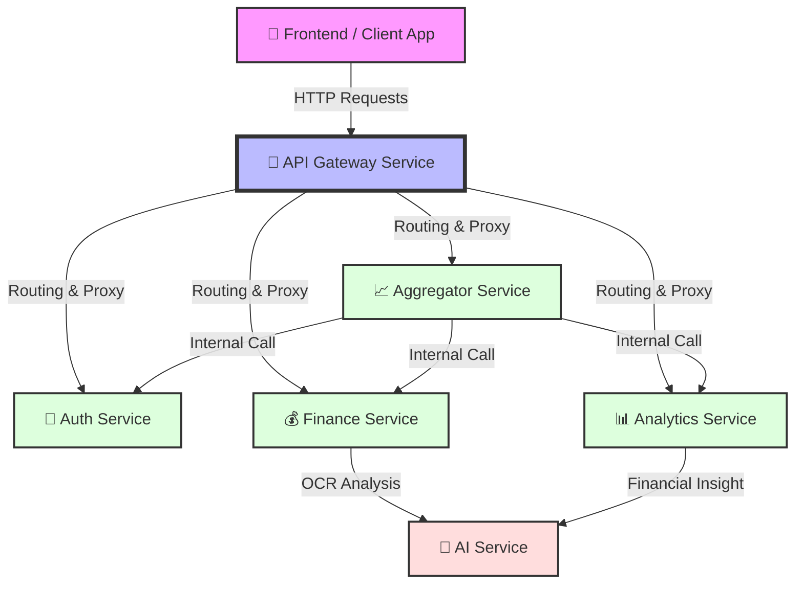

# 📘 Panduan Lengkap & Komprehensif: Menjalankan FAST Backend Monorepo

Selamat datang di repositori utama **FAST Backend**! Dokumentasi ini dirancang sangat detail dan komprehensif agar siapa saja (mulai dari pemula hingga level *advance*) dapat meng-clone, mengonfigurasi, dan menjalankan seluruh ekosistem *microservices* ini dari nol tanpa hambatan, baik di sistem operasi **Windows** maupun **Linux / macOS**.

---

## 🏗️ Arsitektur FAST Backend

Aplikasi **FAST (Financial AI System Tracker)** mengadopsi pola arsitektur **Microservices**. Arsitektur ini membagi sistem ke dalam beberapa layanan (service) kecil yang berdiri sendiri, sehingga lebih mudah untuk dikembangkan, di- *maintain*, dan di- *scale* ke depannya. 

Setiap permintaan (*request*) dari Frontend (Klien) akan selalu masuk melalui satu pintu utama, yaitu **API Gateway**. Gateway ini bertugas memverifikasi keamanan (*authentication*) dan meneruskan permintaan ke layanan-layanan spesifik yang ada di belakangnya. Beberapa layanan juga dapat saling berkomunikasi secara internal (misalnya Aggregator mengambil data dari Analytics dan Auth).

Berikut adalah gambaran aliran datanya:



---

## 🏗️ 1. Arsitektur Sistem & Port
Proyek ini menggunakan arsitektur *microservices* terdistribusi yang terdiri dari 6 layanan mandiri:
1. **Gateway Service** (Node.js/Express) - Port: `3000` (Gerbang API Utama)
2. **Auth Service** (Node.js) - Port: `3001` (Autentikasi & Token)
3. **Aggregator Service** (Node.js) - Port: `3002` (Penggabung Data Layanan)
4. **Finance Service** (Node.js) - Port: `3003` (Layanan Transaksi & Keuangan)
5. **Analytics Service** (Node.js) - Port: `3004` (Layanan Kalkulasi Statistik)
6. **AI Service** (Python/FastAPI) - Port: `8001` (Mesin AI & Prediksi)

---

## 🛠️ 2. Persiapan Sistem (Prerequisites)
Sebelum melangkah ke proses setup, pastikan perangkat Anda telah terpasang perangkat lunak berikut sesuai spesifikasi minimum:

* **Git**: Versi `2.30` atau lebih baru.
* **Node.js**: Versi `18.x` atau `20.x` (Disarankan LTS).
* **Python**: Versi `3.10.x` hingga `3.12.x` (Jangan gunakan versi 3.13 karena beberapa pustaka AI belum kompatibel).
* **Docker & Docker Compose**: Docker Desktop terinstal dan berjalan (untuk metode kontainerisasi).

### Cara Memeriksa Instalasi di Perangkat Anda:
Buka terminal (Command Prompt/PowerShell di Windows, atau Terminal di Linux/macOS) dan ketik:
```bash
git --version
node -v
python --version  # atau python3 --version
docker --version
docker compose version
```

---

## 📥 3. Langkah 1: Kloning Repositori & Inisialisasi Submodule
Karena proyek ini mengadopsi struktur *Git Submodules*, meng-clone repositori utama saja **hanya akan menghasilkan folder kosong** untuk folder `fst-*`. Gunakan salah satu metode di bawah ini agar semua file terunduh dengan sempurna.

### Metode A: Kloning Baru (Sekaligus Menarik Submodule)
Gunakan opsi `--recursive` saat pertama kali meng-clone repositori utama:
```bash
git clone --recursive https://github.com/FASTWorks/fst-backend.git
```

### Metode B: Jika Terlanjur Clone Biasa (Folder `fst-*` Kosong)
Jika Anda sudah terlanjur meng-clone repositori tanpa bendera recursive, masuk ke folder utama dan jalankan perintah penarikan submodule ini:
```bash
cd fst-backend
git submodule update --init --recursive
```
*Catatan: Proses ini memerlukan koneksi internet stabil karena Git akan men-download 6 repositori terpisah secara berurutan.*

---

## ⚙️ 4. Langkah 2: Konfigurasi Environment Variables (`.env`)
Setiap layanan (*service*) membutuhkan variabel lingkungan agar dapat berkomunikasi satu sama lain. 

Di dalam setiap direktori layanan (`fst-gateway-service`, `fst-auth-service`, dll.), terdapat file bernama **`.env.example`**. Anda harus menduplikasi file tersebut menjadi **`.env`** di masing-masing folder tersebut.

### Langkah Cepat Duplikasi `.env` di Terminal:
#### 🪟 Untuk Windows (PowerShell):
```powershell
cp fst-gateway-service/.env.example fst-gateway-service/.env
cp fst-auth-service/.env.example fst-auth-service/.env
cp fst-aggregator-service/.env.example fst-aggregator-service/.env
cp fst-finance-service/.env.example fst-finance-service/.env
cp fst-analytics-service/.env.example fst-analytics-service/.env
cp fst-ai-service/.env.example fst-ai-service/.env
```

#### 🐧 Untuk Linux / macOS:
```bash
cp fst-gateway-service/.env.example fst-gateway-service/.env
cp fst-auth-service/.env.example fst-auth-service/.env
cp fst-aggregator-service/.env.example fst-aggregator-service/.env
cp fst-finance-service/.env.example fst-finance-service/.env
cp fst-analytics-service/.env.example fst-analytics-service/.env
cp fst-ai-service/.env.example fst-ai-service/.env
```
*Silakan buka file `.env` yang baru dibuat di masing-masing folder jika ada konfigurasi khusus (seperti API Key, kredensial DB, dll.) yang ingin Anda ubah.*

---

## 🚀 5. Cara A: Menjalankan Menggunakan Docker (Rekomendasi Utama)
Metode ini adalah cara paling instan dan bebas konflik konfigurasi sistem operasi. Docker akan membuat wadah (*container*) khusus untuk setiap layanan.

### 1. Jalankan Aplikasi dengan Docker Compose
Buka terminal di root direktori `fst-backend`, lalu jalankan:
```bash
docker compose up -d --build
```
* **`-d`**: Menjalankan kontainer di latar belakang (*detached mode*), sehingga terminal tetap dapat digunakan.
* **`--build`**: Memaksa Docker untuk merakit ulang *image* kontainer agar perubahan kode terbaru langsung diterapkan.

### 2. Memeriksa Status Kontainer
Pastikan seluruh kontainer berjalan normal dengan status `Up` (Running):
```bash
docker compose ps
```

### 3. Memeriksa Log Layanan (Sangat Berguna untuk Debugging)
Untuk melihat apa yang terjadi di dalam kontainer secara langsung:
```bash
# Melihat log semua service secara bersamaan
docker compose logs -f

# Melihat log khusus untuk service tertentu saja (misal: Gateway)
docker compose logs -f fst-gateway-service
```

### 4. Mematikan Aplikasi Docker
Jika proses pengerjaan selesai dan Anda ingin membersihkan memori RAM komputer Anda:
```bash
docker compose down
```

---

## 💻 6. Cara B: Menjalankan Secara Manual Lokal (Development Mode)
Pilih metode ini jika Anda berencana aktif mengedit kode sumber (*live coding*) dan ingin proses pemuatan ulang server berjalan instan (*hot-reloading*).

---

### 🪟 LANGKAH SETUP MANUAL DI WINDOWS

#### 1. Setup Python Virtual Environment (Layanan AI)
Layanan AI membutuhkan Python. Kita wajib membuat *virtual environment* terisolasi agar dependensinya tidak mengganggu Python global komputer Anda.
```powershell
# Masuk ke direktori AI Service
cd fst-ai-service

# Membuat virtual environment bernama 'venv'
python -m venv venv

# Mengaktifkan virtual environment
venv\Scripts\activate

# Mengunduh pustaka Python yang dibutuhkan
pip install -r requirements.txt

# Kembali ke folder root proyek utama
cd ..
```
*(Ciri berhasil: Terdapat tanda `(venv)` di ujung kiri terminal Anda).*

#### 2. Install Dependensi Node.js (Semua Service Lainnya)
Pastikan posisi terminal Anda sudah berada di folder utama proyek `fst-backend`, kemudian ketik:
```powershell
npm install
```
*Secara otomatis skrip `postinstall` kami akan bekerja di latar belakang untuk melakukan `npm install` ke-5 layanan berbasis Node.js Anda sekaligus.*

#### 3. Nyalakan Semua Service Sekaligus (Windows)
Jalankan perintah ini di root folder proyek:
```powershell
npm run dev:all
```
*Perintah ini akan membagi terminal Anda menjadi 6 warna berbeda yang memantau performa dan log dari masing-masing service secara real-time.*

---

### 🐧 LANGKAH SETUP MANUAL DI LINUX / macOS

#### 1. Setup Python Virtual Environment (Layanan AI)
Buka terminal Linux/macOS Anda, lalu jalankan:
```bash
# Masuk ke direktori AI Service
cd fst-ai-service

# Membuat virtual environment terisolasi
python3 -m venv venv

# Mengaktifkan virtual environment
source venv/bin/activate

# Mengunduh pustaka Python yang dibutuhkan
pip install -r requirements.txt

# Kembali ke folder root proyek utama
cd ..
```
*(Ciri berhasil: Terdapat tanda `(venv)` di ujung kiri terminal Anda).*

#### 2. Install Dependensi Node.js (Semua Service Lainnya)
Pastikan posisi terminal berada di root folder utama proyek `fst-backend`, lalu jalankan:
```bash
npm install
```
*(Skrip instalasi otomatis kami akan menyebarkan instalasi dependensi ke seluruh folder Node.js).*

#### 3. Nyalakan Semua Service Sekaligus (Linux / macOS)
Jalankan perintah berikut di root folder proyek:
```bash
npm run dev:all:nix
```
*Semua log service akan menyala secara paralel di satu jendela terminal.*

---

## 🛠️ 7. Menjalankan Layanan Secara Individu (Opsional)
Jika komputer Anda terasa berat menjalankan 6 layanan sekaligus, atau Anda hanya fokus mengerjakan salah satu layanan saja, Anda dapat menjalankannya satu per satu.

Buka terminal baru di root folder `fst-backend`, lalu jalankan skrip berikut sesuai kebutuhan:

* **Menjalankan Gateway Service Saja**:
  ```bash
  npm run dev --prefix fst-gateway-service
  ```
* **Menjalankan Auth Service Saja**:
  ```bash
  npm run dev --prefix fst-auth-service
  ```
* **Menjalankan Finance Service Saja**:
  ```bash
  npm run dev --prefix fst-finance-service
  ```
* **Menjalankan Analytics Service Saja**:
  ```bash
  npm run dev --prefix fst-analytics-service
  ```
* **Menjalankan Aggregator Service Saja**:
  ```bash
  npm run dev --prefix fst-aggregator-service
  ```
* **Menjalankan AI Service Saja**:
  1. Buka terminal baru.
  2. Aktifkan virtual environment di folder `fst-ai-service`.
  3. Jalankan: `uvicorn src.main:app --reload --port 8001`

---

## 🧪 8. Verifikasi & Pengujian Layanan (Health Check)
Setelah Anda menjalankan semua layanan (baik melalui Docker maupun Manual), Anda dapat memastikan semuanya berjalan normal dengan mengunjungi URL berikut melalui Browser atau aplikasi API Tester seperti **Postman**:

| Service | Metode Verifikasi | URL / Endpoint | Response Normal (Contoh) |
|---|---|---|---|
| **Gateway** | GET | `http://localhost:3000/` | `{ "status": "Gateway online" }` |
| **Auth** | GET | `http://localhost:3001/health` | `{ "status": "OK" }` |
| **Aggregator**| GET | `http://localhost:3002/health` | `{ "status": "OK" }` |
| **Finance** | GET | `http://localhost:3003/health` | `{ "status": "OK" }` |
| **Analytics** | GET | `http://localhost:3004/health` | `{ "status": "OK" }` |
| **AI Docs** | GET | `http://localhost:8001/docs` | *Menampilkan Halaman Dokumentasi Swagger OpenAPI* |

---

## ❓ 9. Solusi Masalah Umum (Troubleshooting)

### Q: Port `3000` (atau port lainnya) sudah digunakan (*Address already in use*)?
* **Penyebab**: Ada aplikasi lain yang sedang menggunakan port tersebut atau ada proses Node.js lama yang belum dimatikan sempurna di komputer Anda.
* **Solusi Windows**: Buka terminal dan ketik `stop-process -id (get-netstat -port 3000).OwningProcess -force` atau cari PID port bersangkutan di Task Manager lalu End Task.
* **Solusi Linux/macOS**: Ketik `kill -9 $(lsof -t -i:3000)` di terminal untuk menghentikan proses paksa di port 3000.

### Q: Error "pip: command not found" saat setup virtual environment?
* **Penyebab**: Python terinstal tanpa menyertakan Package Manager (`pip`).
* **Solusi**: Instal ulang Python Anda dan pastikan mencentang pilihan **"Add Python to PATH"** serta **"Install pip"** pada aplikasi installer.

### Q: Folder `node_modules` tidak terbuat otomatis setelah `npm install`?
* **Solusi**: Anda dapat masuk ke folder layanan tersebut secara manual (misal: `cd fst-gateway-service`), lalu jalankan `npm install` langsung di dalam folder tersebut satu per satu.

### Q: Error "The table `public.users` does not exist in the current database" saat menggunakan Docker?
* **Penyebab**: Saat *clone* repo *fresh*, file migrasi Prisma mungkin belum terbentuk. Script bawaan mencoba menggunakan `migrate deploy` yang hanya bekerja jika ada file migrasi.
* **Solusi Otomatis**: Kami telah mengupdate *script* peluncur. Pastikan `NODE_ENV=development` ada di `.env.docker` Anda agar sistem menggunakan mode `db push` otomatis.
* **Solusi Manual**: Jika masih error, masuk ke dalam container dan push schema secara manual:
  ```bash
  docker compose exec fst-auth-service npx prisma db push --schema=src/prisma/schema.prisma
  docker compose exec fst-finance-service npx prisma db push
  ```

---

Selamat berkolaborasi dan mengembangkan proyek! 🚀
Jika Anda memiliki pertanyaan lebih lanjut, silakan hubungi tim dev lead atau buka *Issue* baru di repositori utama.
